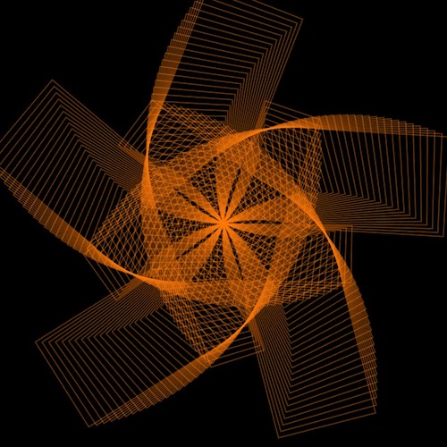
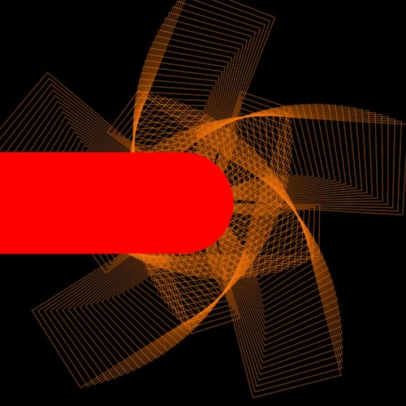
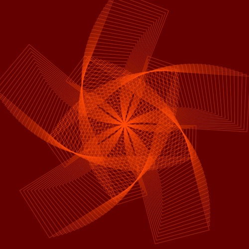
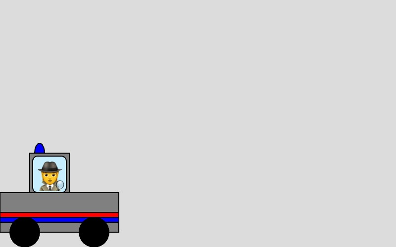
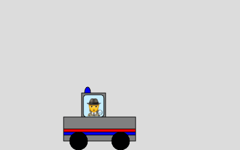
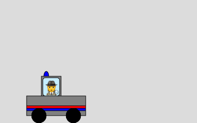
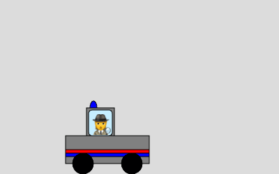

# Common Questions from  CCLab 2024
## Table of Content
1. [Q1:Lifespan](#Q1-Lifespan)
2. [Q2:Partially BlendMode](Q2-Gradient-Color-Animation)
3. [Q3:Pattern Background](#Q3-Pattern-Background)
4. [Q4:Scene Switch](#Q4-Scene-Switch)
5. [Q5:Flipping Through Scale](#Q5-Flipping-Through-Scale())
<br />

## Step-by-step Explanation
### Q1-Lifespan
How to add and modify lifespan for my creatures based on interactions?
<br />

[link-to-p5-web-editor](https://editor.p5js.org/CarrotLiu/sketches/LJwbblAUp)
<br />

Let's borrow some [smiling faces from Marcela](https://editor.p5js.org/mg3273/sketches/E7B4fLMKb). Besides the x, y position and size, we also send an "a" variable into the function to change the transparency of the faces:
```JavaScript
function drawFace(x, y, s, a) {
  push();
  translate(x, y);
  //face
  fill(220, 80, 50, a);
  stroke(255);
  circle(0, 0, s);
  //eyes and mouth
  fill(255);
  circle(-s * 0.3, 0, s * 0.05);
  circle(s * 0.3, 0, s * 0.05);
  arc(0, 0, s * 0.3, s * 0.3, 0, PI);
  pop();
}
```
To create multiple faces, we need to store the x, y, a, and lifespan in arrays. 
```JavaScript
let x = [], y = [], a=[], lifespan = [];
let n = 5; // the number of faces you want to create
function setup(){
  createCanvas(windowWidth, windowHeight);
  for (let i = 0; i < n; i++) {
    x[i] = random(width);
    y[i] = random(height);
    a[i] = 255;
    lifespan[i] = 6;
  }
}
```
The arrays are 
```JavaScript
function attack(){
  for(let i = 0; i < x.length; i ++){
    if(dist(x[i],y[i], mouseX, mouseY) < s[i]){
      lifespan[i] --;
      a[i] = map(lifespan[i], 0, 6, 0, 255);
    }
  }
}
```
The lifespan will be decreased when user clicks within the face. `dist(x[i],y[i], mouseX, mouseY) < s[i]` will measure the distance between the mouse and the face's position, and return `true` if the distance is smaller than the size of the current face.
using `a[i] = map(lifespan[i], 0, 6, 0, 255);`, we map the lifespan value (with it's current range from 0 to 6) to the range of face alpha value (0 to 255). In this way, the current

```JavaScript
function mousePressed(){
  attack();
}
```

<br />

### Q2-Gradient-Color-Animation
How to make gradient color transition with a specific color palette?
<br />

[link-to-p5-web-editor](https://editor.p5js.org/CarrotLiu/sketches/LJwbblAUp)
<br /> 

By defalt, the blendMode is "BLEND". Let's draw a normal rectangle and fill it with red
```JavaScript
noStroke();
fill(255, 0, 0); // red color 
rect(50, 50, 100, 100);
```

```JavaScript
push();
fill(255, 0, 0); // still apply red color
blendMode(DIFFERENCE);
beginShape();
vertex(150, height / 2);
vertex(250, height / 2);
vertex(200, 280);
endShape(CLOSE);
pop();
```
<br />

### Q3-Pattern-Background
How to keep the landscape patterns as background while drawing animated creatures on top?
<br />

[link-to-p5-web-editor](https://editor.p5js.org/CarrotLiu/sketches/JJtUjvEjJ)
<br /> 



Let's steal a [pattern from Moon](https://editor.p5js.org/MOQN/sketches/bGi5ZmoKq). First, put it into a for loop and runs it in `setup()`.
```JavaScript
function setup(){
    for (let i = 0; i < 200; i++) {
        angle += 72+0.2;
        x += -1;
        h += 0.2;
        push();
        translate(width/2, height/2);
        rotate( radians(angle) );
        //blendMode(ADD);
        noFill();
        stroke(255, 120, 10, 100);
        rect(x, 0, 120, h);
        pop();
    }
}
```


Now we have a background with pattern. But if we try to animate a circle in `draw()`, it will leave a trace without a background in `draw()`:
```JavaScript
function draw(){
    noStroke();
    fill(255, 0, 0);
    circle(frameCount, height / 2, 100);
}
```
We cannot draw background in the `draw()` because it will cover the pattern.
<br />

$${\color{orange}Solution One: Using Graphic}$$



[createGraphics()](https://p5js.org/reference/#/p5/createGraphics) creates a p5.Graphics object. You can think of it as a "layer" in a design software like Adobe Photoshop. 
<br />

We can assign to it the same width and height as canvas in `setup()` with `bg = createGraphics(width, height);`. In this way, the p5.Graphics object is stored into the variable "bg". 
<br />

To draw things on "bg", we need to add a `bg.` before every p5 function. For example, if we want to draw a partially transparent red background on "bg", we need to write `bg.background(255, 0, 0,100)`. After we have done writing our "bg", we can display this layer with `image(bg, 0, 0)`, where `0, 0` indicates the coordinates from which we draw the "bg".  
<br />

```JavaScript
let bg;
function setup(){
  createCanvas(400, 400);
  background(0);
  bg = createGraphics(width, height);
  bg.background(255, 0, 0, 100);
  //----- Moon's code for drawing the pattern -----//
  image(bg, 0, 0);
}
```

Therefore, we need to keep the animated shapes (codes that need to run in the `draw()`) on the canvas, while the 

```JavaScript
bg.background(0);
bg.push();
bg.translate(width / 2, height / 2);
bg.rotate(radians(angle));
bg.noFill();
bg.stroke(255, 120, 10, 100);
bg.rect(x, 0, 120, h);
bg.pop();
```
<br />

$${\color{orange}Solution Two: Using Array}$$
Now, let's apply "Array"! Still, our aim is to have all the rectangles generated before the draw loop and then rendered as an "image" in the draw loop.
When we create rectangles in the for loop, we only have three variables --angle, x, h -- that vary in each loop and set each rectangle different from others. If we want a still pattern, the three variables need to be fixed for each rectangles every frame. To achieve this, we can first store these variables into arrays. 

```JavaScript
let patternX = [];
let patternH = [];
let patternA = [];
function setup() {
  createCanvas(400, 400);
  background(0);
  for (let i = 0; i < 200; i++) {
    angle += 72 + 0.2;
    x += -1;
    h += 0.2;
    patternX.push(x);
    patternH.push(h);
    patternA.push(angle);
  }
}
```
After doing this in the `setup()`, we will get three arrays that have equal number of items. 
```JavaScript
patternX = [x0, x1, x2, ..., x199] // length = 200
patternH = [h0, h1, h2, ..., h199] // length = 200
patternA = [a0, a1, a2, ..., a199] // length = 200
```
We can retrieve the variables from the array with the same index `i` (`patternX[i]`, `patternH[i]`, `patternA[i]`) in a for loop. 
```JavaScript
for(let i = 0; i < patternX.length; i ++){
    push();
    translate(width / 2, height / 2);
    rotate(radians(patternA[i]));
    noFill();
    stroke(255, 120, 10, 100);
    rect(patternX[i], 0, 120, patternH[i]);
    pop();
}
```
Now, if we put this for loop in the draw(), the pattern would stay still because the angle, x, and h stay the same every frame as long as the arrays are not updated.
<br />

### Q4-Scene-Switch
How to add life stages to my creatures?
<br />

[link-to-p5-web-editor]()

<br />

```JavaScript

```

<br />

### Q5-Flipping-Through-Scale()
How to make my asymmetric creature flip when it hits a border and turns?
<br />

[link-to-p5-web-editor](https://editor.p5js.org/CarrotLiu/sketches/yVVZDbJAR)
<br />



Let's get a car and a driver from [Leon](https://editor.p5js.org/leon-eckert/sketches/8k4Y87h1o) and slightly modify the car's shape so that it's asymmetric. 

```JavaScript
function drawCar(carColor, driver){
  push()
  translate(x, y)
  //----- Leon's code for drawing the car & driver-----//
  pop()
}
```

Now The driver drives the car across the canvas. He decides to turn back when he reaches the canvas border. To make that happen, we need to apply a flipping effect to both the driver and the car using `scale()`. Notice that putting `scale()` after the `translate()` and before the drawing codes will scale all the shapes from position `(x, y)`:

```JavaScript
function drawCar(carColor, driver){
  push()
  translate(x, y)
  scale(-1); 
  //----- Leon's code for drawing the car & driver-----//
  pop()
}
```

<br />

Ooops, the car turns over! Why? This problem is caused by the flipping of the whole coordination system. When we put only one value in `scale()`, both `x` and `y` (and `z` if you are working in 3D) are affected. Putting a positive number will scale the shape propotionally, while a negative numbers flip the shape on both axises.

If we put two numbers in `scale(a, b)`, `a` will scale the x axis and `b` will scale the y axis. e.g. If we use `scale(-1,1)` in our sketch, we will flip the car vertically but not horizontally. Now the car is flipping only on the x axis:
<p align="center">

</p>

```JavaScript
function drawCar(carColor, driver){
  push()
  translate(x, y)
  scale(-1, 1); 
  //----- Leon's code for drawing the car & driver-----//
  pop()
}
```
<br />

Now let's add the condition for the car turning moment in the `draw()`:

```JavaScript
let xSpd = 1;
let s = 1;
function draw(){
  if(x >= width - 120 || x < 0){
    xSpd *=-1;
    s *= -1;
  }
  x+=xSpd; // x is added by 1 before turning, and minus by 1 after turning.
  drawCar("grey", "🕵️‍");
}
function drawCar(carColor, driver){
  push()
  translate(x, y)
  scale(s, 1);
  //----- Leon's code for drawing the car & driver-----//
  pop()
}
```
<p align="center">

</p>

You may notice that when the car hits the border, it makes a huge jump to the left and moves pass the left border on canvas. This is because the scale origin `(x, y)` is not at the exact center of the car. We can easily fix that by translating the car to `(offsetX, 0)` after scaling: 

```JavaScript
if(x >= width - 120 || x < 0){
  xSpd *=-1;
  s *= -1;
  if(s == -1){
    offsetX = -110;
  }else{
    offsetX = 0;
  }
}
```
``` JavaScript
function drawCar(carColor, driver){
  push()
  translate(x, y)
  scale(s, 1);
  translate(offsetX, 0);
  //----- Leon's code for drawing the car & driver-----//
  pop()
}
```
<p align="center">
  
</p>
