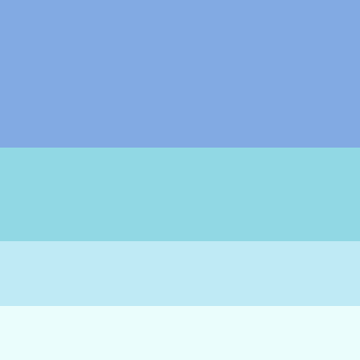

# :white_flower: MagicDande Tutorial - Part1 :white_flower:

## F23 Creative Coding Lab Midterm

> [!NOTE]
> This tutorial provides a complete walk-through from concept development to implementation based on the [Project A Prompt](https://docs.google.com/document/d/11haMfqNY1PYHohEQlD3-yF6Mmleu6-2Nn-Ldfb8Hi9I/edit).
> In particular, it suggests a way of developing a creature from abstract patterns and visuals, which you (or some of you) enjoyed during the Week 4 Recitation: Pattern.
> Good luck on your midterm, CCLabers!

### Knowledge Covered:

- structure: if(), for(), function(), array
- transform: translate()
- math: sin(), cos(), map(), dist()
- shape: circle(), bezier(), line()
- color: gradient color control using RGB, array, and sine waves


## :wave: Welcome abroad, traveler from Earth! :wave:

I'm Dandie and I'm part of [the MagicDande family](https://carrotliu.github.io/Creative-Coding-Tutorial/Midterm/midterm-complete/) living on planet B611.

Timid and introvert by nature, I shy away from your touch.

I light up the world with my colorful glow, and I bless the universe with my flying seeds, traveling into the endless darkness.

My Little Prince grew me using p5.js, a little bit of math, some logic, and a lot of playfulness!

Oh dear traveler from Earth, are you ready to become the Little Prince of your one and only MagicDande on B611? Here's a copy of my Little prince's Planting Journal.

## Planting Journal 2023

### Table of Content

- [step1 pattern](https://github.com/CarrotLiu/Creative-Coding-Tutorial/tree/main/Midterm#pattern-play-with-the-for-loops-and-create-the-pattern)
- [step2 motion](https://github.com/CarrotLiu/Creative-Coding-Tutorial/tree/main/Midterm#motion-make-the-pattern-move)
- [step3 swaying-effect](https://github.com/CarrotLiu/Creative-Coding-Tutorial/tree/main/Midterm#swaying-effect-let-there-be-a-swaying-stem)
- [step4 interaction](https://github.com/CarrotLiu/Creative-Coding-Tutorial/tree/main/Midterm#interaction-dont-touch-me)
- [step5 function](https://github.com/CarrotLiu/Creative-Coding-Tutorial/tree/main/Midterm#function-become-elegant-and-save-some-labor)
- [step6 gradient color](https://github.com/CarrotLiu/Creative-Coding-Tutorial/tree/main/Midterm#gradient-color-shine)

### Pattern: Play with the For Loops and Create the Pattern!

What should I make? I have no idea at the beginning, so I decide to experiment with patterns in the `setup()` function.

> [!NOTE]
> In class, professor created a grid system with nested `for()` loop. The inner `for()` loop will increase the index value in the x direction (horizontally), while the outer `for()` loop will increase it in y direction (vertically).
> The grid system is a result of the increasing indexes being applied to the x, y position of a p5 shape.


Now, instead of applying the indexes directly to the x, y position, I'll apply them to the sin(freq) * amp and cos(freq) * amp.

Just to recap, the `freq` affect how many samples will be extracted from a certain period of the sin wave. The smaller the increment of `freq`, the more samples one gets. `amp` refers to the size each sample is scaled to.

If I assign the same `freq` and `amp` to the `sin()` and `cos()`, and apply the values to the x, y position of the circle in nested for loop, I will get a pattern of circles arranged in a circular fashion with multiple layers:

```JavaScript
for (let r = 0; r < 6; r++) {
  for (let i = 0; i < 2 * PI; i += (2 * PI) / 12) {
    fill(255);
    noStroke();
    let x1 = sin(i) * (r * 20);
    let y1 = cos(i) * (r * 20);
    circle(x1, y1, 10);
  }
}
```


Here, I get `r` layers of circles, and each layer has _2*PI / (2 * PI / 12)_ circles.

The outer for loop iterates through different "layers". The variable `r` represents the current layer, and the loop will run from `r = 0` to `r = 5`, which means it will create 6 layers.

```Javascript
for (let r = 0; r < 6; r++)
```

The inner for loop iterates through angles from 0 to `2 * PI` (a full circle) and divides the circle into 12 equal segments. The variable `i` represents the current angle in radians.

```Javascript
for (let i = 0; i < 2 * PI; i += (2 * PI) / 12)
```

The following code calculates the x and y coordinates for the center of each circle within the layer. It maps the angles `i` to the positions on the circle. Making the amplitude `r * 20` increases the radius of circles layer by layer.

```Javascript
let x1 = sin(i) * (r * 20);
let y1 = cos(i) * (r * 20);
```

Since the first layer starts from `r = 0`, the 12 circles overlap with each other. I'll offset them by 30 from the center:

```Javascript
let x1 = sin(i) * (30 + r * 20);
let y1 = cos(i) * (30 + r * 20);
```


The `freq` for each layer are the same, making the circles stay in lines. Too boring. Let me make the `freq` different through using the the `r` index value (the outer for loop index):

```JavaScript
let x1 = sin((PI / 5) * r + i) * (30 + r * 20);
let y1 = cos((PI / 5) * r + i) * (30 + r * 20);
```


This looks nice! I'm getting some spiral effect. I find that there're always 12 samples on each layer because the increment of `i`is a constant. Gonna make it vary for each layer by applying `r` value again:

```JavaScript
for (let r = 0; r < 6; r++) {
    for (let i = 0; i < 2 * PI; i += (2 * PI) / (11 + r * 3)) {
      fill(255);
      noStroke();
      let x1 = sin((PI / 2) * (r + 1) + i) * (40 + r * 20);
      let y1 = cos((PI / 2) * (r + 1) + i) * (40 + r * 20);
      circle(x1, y1, 10);
    }
}
```


Aha! Now I get a much more scattered pattern. It still looks a bit boring though. The circles are of the same size. What about having bigger circles for outer layers?

```JavaScript
circle(x1, y1, 6 + r * 3.5);
```


Hmmmm... Better, but too crowded. Let me makes the size of circles in the same layer vary by using `sin()` and `i`. I need to map it to a range of positive value as circle radius must be positive:

```JavaScript
circle(x1, y1, map(sin(i + PI / 2), -1, 1, 3, 6 + r * 3.5));
```


Cool! Now it's a perfect time to make it move!

### Motion: Make the Pattern Move!

The pattern inspires me to create a spiral motion through changing the radius of each circles rather than their position.
I move all the code after the `createCanvas()` into the `draw()` function.
Then, I replace the `r` value in the that change the sine wave frequency with the `frameCount`. This creates a dynamic effect where the radius of the circles in each layer fluctuates over time.

```JavaScript
function draw() {
  background(0);

  translate(width / 2, height / 2);
  for (let r = 0; r < 6; r++) {
    for (let i = 0; i < 2 * PI; i += (2 * PI) / (11 + r * 3)) {
      fill(255);
      noStroke();
      let x1 = sin((PI / 2) * (r + 1) + i) * (40 + r * 20);
      let y1 = cos((PI / 2) * (r + 1) + i) * (40 + r * 20);
      circle(x1, y1, map(sin(i + frameCount * 0.05), -1, 1, 3, 6 + r * 3.5));
    }
  }
}
```


The pattern reminds me of seeds of dandelions swaying in the wind...
Aha! Let there be a Magic Dandelion on B611!
Let there be a core in the middle of the flower!
Let there be stems for the seeds!

```JavaScript
translate(width / 2, height / 2);
for (let r = 0; r < 6; r++) {
    for (let i = 0; i < 2 * PI; i += (2 * PI) / (11 + r * 3)) {
        let x1 = sin((PI / 2) * (r + 1) + i) * (40 + r * 20);
        let y1 = cos((PI / 2) * (r + 1) + i) * (40 + r * 20);
        fill(255);
        stroke(255, 100);
        strokeWeight(1.5);
        line(x1, y1, 0, 0);
        noStroke();
        circle(x1, y1, map(sin(i + frameCount * 0.05), -1, 1, 3, 6 + r * 3.5));
    }
}
circle(0, 0, 30);
```


Oooops, the wind is blowing! Seeds are flowing!

```JavaScript
strokeWeight(map(sin(i + frameCount * 0.05), -1, 1, 0.01, 2));
```


Here I make the strokeWeight fluctuate using the same mapping trick. The seeds' stem are now swaying with the wind.
Cool cool cool.
Wait, I think I miss something...
The stem! The flower itself needs a stem!

### Swaying Effect: Let There Be a Swaying Stem!

Maybe just add a line before the for loop:

```JavaScript
function draw() {
  background(0);

  translate(width / 2, height / 2);
  push();
  fill(255);
  stroke(255, 100);
  strokeWeight(5);
  line(0, 0, 0, 600);
  pop();
  for (let r = 0; r < 6; r++) {
    for (let i = 0; i < 2 * PI; i += (2 * PI) / (11 + r * 3)) {
      let x1 = sin((PI / 2) * (r + 1) + i) * (40 + r * 20);
      let y1 = cos((PI / 2) * (r + 1) + i) * (40 + r * 20);
      fill(255);
      stroke(255, 100);
      strokeWeight(map(sin(i + frameCount * 0.05), -1, 1, 0.01, 2));
      line(x1, y1, 0, 0);
      noStroke();

      circle(x1, y1, map(sin(i + frameCount * 0.05), -1, 1, 3, 6 + r * 3.5));
    }
  }
  circle(0, 0, 30);
}
```


And make it sway:

```JavaScript
let x = map(sin(frameCount * 0.01), -1, 1, -60, 60);
let y = map(cos(frameCount * 0.01), -1, 1, -10, 0);
line(x, y, 0, 600);
```


Oooops! Something bad happens! The flower is not following along!
Let me fix it:

```JavaScript
for (let r = 0; r < 6; r++) {
    for (let i = 0; i < 2 * PI; i += (2 * PI) / (11 + r * 3)) {

      fill(255);
      stroke(255, 100);
      strokeWeight(map(sin(i + frameCount * 0.05), -1, 1, 0.01, 2));
      line(x1, y1, x, y);
      noStroke();
      circle(x1, y1, map(sin(i + frameCount * 0.05), -1, 1, 3, 6 + r * 3.5));
    }
  }
  circle(x, y, 30);
```


Here's some break-down:

The first step is to make the seeds follow. So offset all the seeds' position x1 and y1 by x and y:

```JavaScript
let x1 = x + sin((PI / 2) * (r + 1) + i) * (40 + r * 20);
let y1 = y + cos((PI / 2) * (r + 1) + i) * (40 + r * 20);
```

Then, make the seeds' stems follow by making the line's endpoints (x, y):

```JavaScript
line(x1, y1, x, y);
```

Finally, make the core follow by positioning the core circle at (x, y):

```JavaScript
circle(x, y, 30);
```

Bug fixed. But it looks very weird. The stem of the dandelion should be bending while swaying. In this case, I would need a `bezier()` function:

```JavaScript
noFill();
bezier(x, y, 0, 150, 0, 500, 0, 500);
```


Nice! Now let's add some character to my little magic Dandie~

### Interaction: Don't Touch Me!

Dandie is timid. So it shies away from my touch. The seeds will move away from the hand (or mouse) and reinstate their positions when the hand moves away.
Since the seeds are drawn at (x1, y1), I'll first get the distance between the (x1, y1) and the (mouseX, mouseY), and when the distance is smaller than, say, 20, map x1, y1 to an opposite range (meaning that the bigger the distance, the smaller the change of seeds' position).

```JavaScript
let x1 = x + sin((PI / 2) * (r + 1) + i) * (40 + r * 20);
let y1 = y + cos((PI / 2) * (r + 1) + i) * (40 + r * 20);
let dmouse = dist(x1, y1, mouseX, mouseY);
if (dmouse <= 20) {
y1 += map(dmouse, 0, 20, 10, 0);
x1 += map(dmouse, 0, 20, 10, 0);
}
```


Ooooops, the seeds stay still when mouse is hovering. But they shakes when the mouse is on the top left corner of the window. Why?

`(x1, y1)` works for the seeds' (or circles') position because the `translate(width / 2, height / 2)` is applied, and the circles' actual position on canvas is `(x1 + width / 2, y1 + height / 2)`.
However, the translation is not applied to `dist()` since it doesn't have an origin and isn't doing shape drawing. When I write `dist(x1, y1, mouseX, mouseY)`, the function is just detecting the distance between `(x1, y1)` and `(mouseX, mouseY)`, not `(x1 + width / 2, y1 + height / 2)` and `(mouseX, mouseY)`.

Let me fix it by adding the `width / 2, height / 2` to the `x1, y1` in `dist()`.

```JavaScript
let dmouse = dist(x1 + width / 2, y1 + height / 2, mouseX, mouseY);
```


Done!

### Function: Become Elegant and Save Some Labor!

Dandie should have a family. But it's too tedious to copy all the codes several times and change variables for each. Instead, I would pack all the code that draws Magic Dande into a function `drawDandFlower()`.

```JavaScript
function draw() {
  background(0);
  drawDandFlower();
}

function drawDandFlower() {
  push();
  translate(width / 2, height / 2);
  push();
  noFill();
  stroke(255, 100);
  strokeWeight(5);
  let x = map(sin(frameCount * 0.01), -1, 1, -60, 60);
  let y = map(cos(frameCount * 0.01), -1, 1, -10, 0);
  bezier(x, y, 0, 150, 0, 500, 0, 500);
  pop();
  for (let r = 0; r < 6; r++) {
    for (let i = 0; i < 2 * PI; i += (2 * PI) / (11 + r * 3)) {
      let x1 = x + sin((PI / 2) * (r + 1) + i) * (40 + r * 20);
      let y1 = y + cos((PI / 2) * (r + 1) + i) * (40 + r * 20);
      let dmouse = dist(x1 + width / 2, y1 + height / 2, mouseX, mouseY);
      if (dmouse <= 20) {
        y1 += map(dmouse, 0, 20, 10, 0);
        x1 += map(dmouse, 0, 20, 10, 0);
      }
      fill(255);
      stroke(255, 100);
      strokeWeight(map(sin(i + frameCount * 0.05), -1, 1, 0.01, 2));
      line(x1, y1, x, y);
      noStroke();
      circle(x1, y1, map(sin(i + frameCount * 0.05), -1, 1, 3, 6 + r * 3.5));
    }
  }
  circle(x, y, 30);
  pop();
}
```

This results in the same visuals as the last step. Now I want to vary the layer number for each Magic Dande. I add a parameter `layerNum` into the function to replace the `r` in the for loop, and when I call the function, I pass in different number to get dandelions with different layers:

```JavaScript
function draw(){
    drawDandFlower(6);
    drawDandFlower(3);
    drawDandFlower(4);
}

function drawDandFlower(layerNum) {
    for (let r = 0; r < layerNum; r++) {

    }
}
```

As a result, I get 3 dandelions that respectively has 6, 3, and 4 layers of seeds.
However, they're now overlapping with each other and I want them to spread across the canvas.

```JavaScript
function draw(){
    drawDandFlower(6, width / 2, height / 2);
    drawDandFlower(3, width / 2 - 200, height / 2 + 80);
    drawDandFlower(4, width / 2 + 190, height / 2 + 100);
}

function drawDandFlower(layerNum, transX, transY) {
    translate(transX, transY);
    for (let r = 0; r < layerNum; r++) {

    }
}
```


Now they're scattered. But wait, why they shy together when I'm only touching the middle one?
That's, again, because the `dist()` accepts position as the actual, absolute pos on canvas and isn't affected by the `translate()` function. Since `(x1 + width / 2, y1 + width / 2)` remains the same for all dandelions, their seeds would shy away together.
To fix this, we need to apply the translation manually again:

```JavaScript
let distFromCentX = transX - width / 2;
let distFromCentY = transY - height / 2;
let dmouse = dist(
    x1 + width / 2 + distFromCentX,
    y1 + height / 2 + distFromCentY,
    mouseX,
    mouseY
);
```


Great! Now it's a perfect time to add color!

### Gradient Color: Shine!


I decide to use a [green color palette](https://colorhunt.co/palette/388e3c8bc34adce775fff59d) from the [colorhunt.co](https://colorhunt.co), a nice color palette website. And I apply the some colors to the dandelion stem, core, and seeds:

```JavaScript
stroke(56, 142, 60);
bezier(x, y, 0, 150, 0, 500, 0, 500);
for (let r = 0; r < layerNum; r++) {
    for (let i = 0; i < 2 * PI; i += (2 * PI) / (11 + r * 3)) {
        fill(220, 231, 117);
        circle(x1, y1, map(sin(i + frameCount * 0.05), -1, 1, 3, 6 + r * 3.5));
    }
}
fill(255, 245, 157);
circle(x, y, 30);
```


Why not make the core's and seeds' colors changes as time goes by? After all, it's a MAGIC dandelion.

I notice that the r, g, b value of the gradient color increase or decrease respectively in the same direction. This means that, if I get the min value and max value of the r, g, b respectively, and map them to a fluctuating function like `sin()`, I will get a gradient shifting color based on the color palettes' colors.

So, simple trick with sine function again:

```JavaScript
let fluctation = sin((PI / 2) * (r + 1) + i);
let redV = map(fluctation, -1, 1, 56, 255);
let greenV = map(fluctation, -1, 1, 142, 245);
let blueV = map(fluctation, -1, 1, 60, 157);
fill(redV, greenV, blueV);
```


But what if I want more gradient colors, like pink and blue? And what if I want to change the color base by sending another parameter when calling the `drawDandFlower()` function?




In order to do that, we need an array to store the min and max values of the color palettes.

```JavaScript
let colorRange = [
  [
    [56, 142, 60], // green min
    [255, 245, 157], // green max
  ], // green
  [
    [255, 234, 221], // pink min
    [255, 102, 102], // pink max
  ], // pink
  [
    [130, 170, 227], // blue min
    [234, 253, 252], // blue max
  ], // blue
];
```

This is frightening! A THREE-DIMENSIONAL ARRAY!!!! Let me try to take the value `56` from this array.
First, we need to access the green palette array. It's at the index `0` of the array `colorRange`:

```JavaScript
greenArray = colorRange[0]; // [[56, 142, 60], [255, 245, 157]]
```

Then we need to get the min value array from the greenArray, which is at the index `0` of the array `greenArray`:

```JavaScript
greenArray = colorRange[0];
greenMinArray = greenArray[0];
```

Finally, we can get `56` from the greenMinArray using index `0`:

```JavaScript
greenArray = colorRange[0]; // [[56, 142, 60], [255, 245, 157]]
greenMinArray = greenArray[0]; // [56, 142, 60]
greenMinRedValue = greenMinArray[0]; // 56
```

Now, instead of using three variables, we can use only one line of code achieve the same thing:

```JavaScript
let MinR = colorRange[0][0][0]; // 56
```

And we can get all the min and max for green palette by:

```JavaScript
let GMinR = colorRange[0][0][0]; // 56
let GMinG = colorRange[0][0][1]; // 142
let GMinB = colorRange[0][0][2]; // 60
let GMaxR = colorRange[0][1][0]; // 255
let GMaxG = colorRange[0][1][1]; // 245
let GMaxB = colorRange[0][1][2]; // 157
```

For pink palette:

```JavaScript
let PMinR = colorRange[1][0][0]; // 255
let PMinG = colorRange[1][0][1]; // 234
let PMinB = colorRange[1][0][2]; // 221
let PMaxR = colorRange[1][1][0]; // 255
let PMaxG = colorRange[1][1][1]; // 102
let PMaxB = colorRange[1][1][2]; // 102
```

For blue palette:

```JavaScript
let BMinR = colorRange[2][0][0]; // 130
let BMinG = colorRange[2][0][1]; // 170
let BMinB = colorRange[2][0][2]; // 227
let BMaxR = colorRange[2][1][0]; // 234
let BMaxG = colorRange[2][1][1]; // 253
let BMaxB = colorRange[2][1][2]; // 252
```

I find the rule! We just need to pass the first index (`colorRange[0]`, `colorRange[2]`, `colorRange[0]`) to get the palette we want, and the rest indexes will stay the same.


So, in the `drawDandFlower()` function, let's add one parameter `ci` to indicate the palette indexes, and drwa three dandelions with different color palette passing the indexes:

```JavaScript
function draw() {
  drawDandFlower(6, width / 2, height / 2, 0);
  drawDandFlower(3, width / 2 - 200, height / 2 + 80, 1);
  drawDandFlower(4, width / 2 + 190, height / 2 + 100, 2);
}
function drawDandFlower(layerNum, transX, transY, ci) {
    let redV = map(fluctation, -1, 1, colorRange[ci][0][0], colorRange[ci][1][0]);
    let greenV = map(fluctation, -1, 1, colorRange[ci][0][1], colorRange[ci][1][1]);
    let blueV = map(fluctation, -1, 1, colorRange[ci][0][2], colorRange[ci][1][2]);
    fill(redV, greenV, blueV);
}
```

Boom! Success! I also want the core to fluctuate with the color palette. But the core is drawn out of the nested for loop and I have to copy the complex color code again... So I make the color code another function:

```JavaScript
function assignColor(baseColorIndex, fluct) {
  fill(
    map(
      fluct,
      -1,
      1,
      colorRange[baseColorIndex][0][0],
      colorRange[baseColorIndex][1][0]
    ),
    map(
      fluct,
      -1,
      1,
      colorRange[baseColorIndex][0][1],
      colorRange[baseColorIndex][1][1]
    ),
    map(
      fluct,
      -1,
      1,
      colorRange[baseColorIndex][0][2],
      colorRange[baseColorIndex][1][2]
    )
  );
}
```


And I call this function respectively before drawing the seeds and core:

```JavaScript
for (let r = 0; r < layerNum; r++) {
    for (let i = 0; i < 2 * PI; i += (2 * PI) / (11 + r * 3)) {
      let fluctation = sin((PI / 2) * (r + 1) + i);
      assignColor(ci, fluctation);
      noStroke();
      circle(x1, y1, map(sin(i + frameCount * 0.05), -1, 1, 3, 6 + r * 3.5));
    }
  }
  let fluctuate2 = sin(PI / 2 + frameCount * 0.01);
  assignColor(ci, fluctuate2);
  circle(x, y, 30);
```

A few more steps to make my MagicDandes more beautiful. I add an array for the stem color. This time it's easier, with a two-dimensional array:

```JavaScript
// Stem
let colorBase = [
  [56, 130, 60], // green
  [250, 80, 80], //pink
  [120, 150, 190], //blue
];
function drawDandFlower(){
    stroke(colorStem[ci][0], colorStem[ci][1], colorStem[ci][2]);
    strokeWeight(5);
    let x = map(sin(frameCount * 0.01), -1, 1, -60, 60);
    let y = map(cos(frameCount * 0.01), -1, 1, -10, 0);
    bezier(x, y, 0, 150, 0, 500, 0, 500);
}
```


Yeah! Let there be more Magic Dande!

```JavaScript
function draw(){
    drawDandFlower(5, width / 2, height / 2, 0);
    drawDandFlower(2, width / 2 - 250, height / 2 + 100, 1);
    drawDandFlower(3, width / 2 + 300, height / 2 + 80, 2);
    drawDandFlower(6, width / 2 + 550, height / 2 + 60, 1);
    drawDandFlower(4, width / 2 - 500, height / 2 + 50, 2);
}
```


## Live Site Links

- [Midterm Step1 - pattern](https://carrotliu.github.io/Creative-Coding-Tutorial/Midterm/midterm-step1-pattern/).
- [Midterm Step2 - motion](https://carrotliu.github.io/Creative-Coding-Tutorial/Midterm/midterm-step2-motion/).
- [Midterm Step3 - swaying effect](https://carrotliu.github.io/Creative-Coding-Tutorial/Midterm/midterm-step3-swaying-effect/).
- [Midterm Step4 - interaction](https://carrotliu.github.io/Creative-Coding-Tutorial/Midterm/midterm-step4-interaction/).
- [Midterm Step5 - function](https://carrotliu.github.io/Creative-Coding-Tutorial/Midterm/midterm-step5-function/).
- [Midterm Step6 - gradient-color](https://carrotliu.github.io/Creative-Coding-Tutorial/Midterm/midterm-step6-gradient-color/).
- [Midterm Complete Demo](https://carrotliu.github.io/Creative-Coding-Tutorial/Midterm/midterm-complete/).
